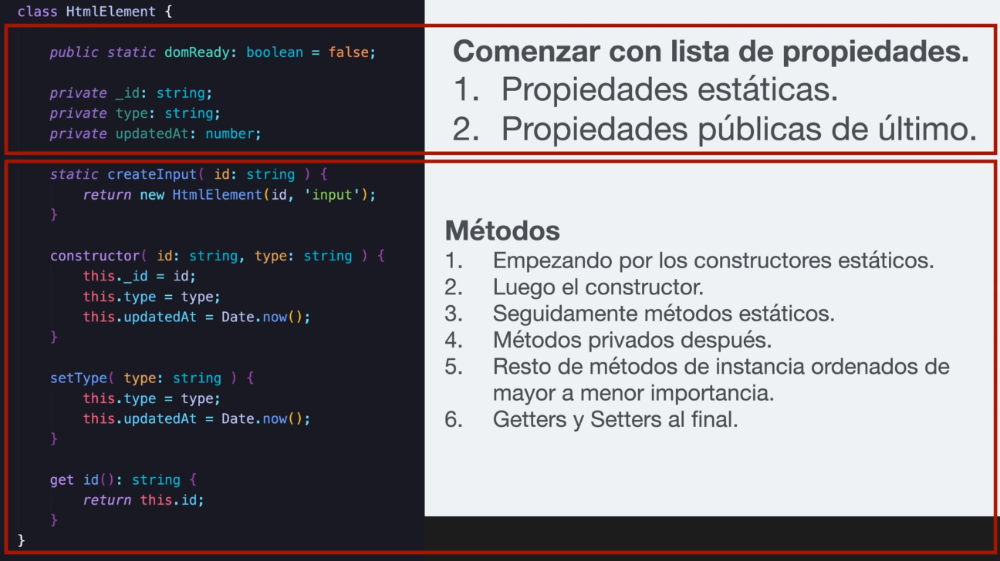

# Clases

Las clases deben tener una responsabilidad específica y bien definida, es importante evitar nombres genéricos, ya que esto implica que las clases realicen demasiado trabajo o más trabajo que el que deberían hacer. Las clases deben tener nombres formados por un sustantivo o frases de sustantivo, 

**Se procura usar UpperCamelCase**

Para determinar si un nombre de clase es bueno se debe responder tres preguntas:

1. ¿Qué exactamente hace la clase?
2. ¿Cómo exactamente esta clase realiza cierta tarea?
3. ¿Hay algo específico sobre su ubicación?

```typescript
// 🟥 bad
class Manager {}
class Data {}
class Info {}
class Individual {}
class Processor {}
class SpecialMonsterView {}
```

## Ejercicio

```typescript
// 🟥 No single responsibility principle
type Gender = "M" | "F";

class Person {
  public name: string;
  public gender: Gender;
  public birthdate: Date;

  // create constructor first option
  constructor(
    name: string,
    gender: Gender,
    birthdate: Date,
  ){
    this.name = name;
    this.gender = gender;
    this.birthdate = birthdate;
  }

  // create constructor second option
  constructor(
    public name: string,
    public gender: Gender,
    public birthdate: Date,
  ){}
}

class User extends Person {

  public lastAccess: Date,

  constructor(
    public email: string,
    public role: string,
    name: string,
    gender: Gender,
    birthdate: Date,
  ){
    super(name, gender, birthdate);
    this.lastAccess = new Date();
  }

  checkCredentials() {
    return true;
  }
}

class UserSettings extends User {
  constructor(
    public workingDirectory: string,
    public lastOpenFolder: string,
    email: string,
    role: string,
    name: string,
    gender: Gender,
    birthdate: Date,
  ){
    super(email, role, name, gender, birthdate);
  }
}

```

```typescript
// 🟥 No single responsibility principle
// 🟨 using object as param
type Gender = "M" | "F";

interface PersonProps {
  name: string;
  gender: Gender;
  birthdate: Date;
}

class Person {

  public name: string;
  public gender: Gender;
  public birthdate: Date;

  constructor({name, gender, birthdate}: PersonProps){
    this.name = name;
    this.gender = gender;
    this.birthdate = birthdate;
  }
}

interface UserProps {
  email: string;
  role: string;
  name: string;
  gender: Gender;
  birthdate: Date;
}

class User extends Person {

  public lastAccess: Date;
  public email: string,
  public role: string,

  constructor({email, role, name, gender, birthdate}: UserProps){
    super({name, gender, birthdate});
    this.email = email;
    this.role = role;
    this.lastAccess = new Date();
  }

  checkCredentials() {
    return true;
  }
}

interface UserSettingsProps {
  workingDirectory: string;
  lastOpenFolder: string;
  email: string;
  role: string;
  name: string;
  gender: Gender;
  birthdate: Date;
}

class UserSettings extends User {

  public workingDirectory: string;
  public lastOpenFolder: string;

  constructor( {workingDirectory, lastOpenFolder, email, role, name, gender, birthdate}: UserSettingsProps){
    super({email, role, name, gender, birthdate});
    this.workingDirectory = workingDirectory;
    this.lastOpenFolder = lastOpenFolder;
  }
}
```

```typescript
// 🟩 Single responsibility principle
// Priorizar la composición frente a la herencia 🚀
type Gender = "M" | "F";

interface PersonProps {
  name: string;
  gender: Gender;
  birthdate: Date;
}

class Person {

  public name: string;
  public gender: Gender;
  public birthdate: Date;

  constructor({name, gender, birthdate}: PersonProps){
    this.name = name;
    this.gender = gender;
    this.birthdate = birthdate;
  }
}

interface UserProps {
  email: string;
  role: string;
}

class User {

  public lastAccess: Date;
  public email: string,
  public role: string,

  constructor({email, role}: UserProps){
    this.email = email;
    this.role = role;
    this.lastAccess = new Date();
  }

  checkCredentials() {
    return true;
  }
}

interface SettingsProps {
  workingDirectory: string;
  lastOpenFolder: string;
}

class Settings {

  public workingDirectory: string;
  public lastOpenFolder: string;

  constructor( {workingDirectory, lastOpenFolder}: UserSettingsProps){
    this.workingDirectory = workingDirectory;
    this.lastOpenFolder = lastOpenFolder;
  }
}

interface UserSettingsProps {
  workingDirectory: string;
  lastOpenFolder: string;
  email: string;
  role: string;
  name: string;
  gender: Gender;
  birthdate: Date;
}

class UserSettings {
  public person Person;
  public user User;
  public settings Settings;

  constructor({ name, gender, birthdate, email, role, lastOpenFolder, workingDirectory}: UserSettingsProps){
    this.person = new Person({ name, gender, birthdate });
    this.user = new User({ email, role });
    this.settings = new Settings({ lastOpenFolder, workingDirectory });
  }
}
```

## Estructura recomendada

<table>
  <tr>
    <td align="center" valign="center"></td>
  </tr>
 </table>