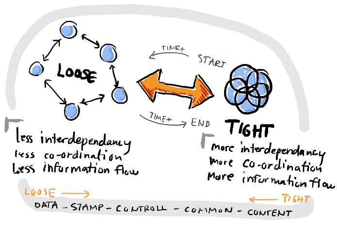

# Acrónico STUPID

Este acrónimo se enfoca en todas las prácticas que no deberíamos hacer, este acrónimo es la concatenación de varios antipatrones. También se los conoce como `code smells`.

**S**`ingleton`: patrón singleton

**T**`ight coupling`: alto acoplamiento

**U**`ntestability`: código no probable (unit test)

**P**`remature optimization`: optimizaciones prematuras

**I**`ndescriptive naming`: nombres poco descriptivos

**D**`uplication`: duplicidad de código (sin DRY)

## Singleton

El único punto a favor de este patrón es que nos garantiza una única instancia de la clase a lo largo de toda la aplicación. Sin embargo, se considera un `code smell` por:

* Vive en el contexto global
* Puede ser modificado por cualquiera y en cualquier momento
* No es rastreable
* Defícil de testear debido a su ubicación

## Tight coupling (Alto acomplamiento / Baja cohesión)

Lo ideal en cualquier desarrollo de software es tener un bajo acoplamiento y una alta cohesión.

### La `cohesión` se refiere a lo que la clase o módulo puede hacer

La baja cohesión significaría que la clase realiza una gran variedad de acciones: es amplia, no se enfoca en lo que debe hacer.

La alta cohesión significa que la clase se enfoca en lo que debería estar haciendo, es decir, solo métodos relacionados con la intención de la clase.

### El `acoplamiento` se refiere a cuán relacionadas o dependientes son dos clases o módulos entre sí

En bajo acoplamiento, cambiar algo importante en una clase, no debería afectar otra

En alto acoplamiento, dificultaría el cambio y mantenimiento del código, hacer un cambio podría requerir una renovación completa del sistema.

**Desventajas de un alto acoplamiento**

* Un cambio en un módulo por lo general provoca un efecto dominó de los cambios en otros módulos
* El ensamblaje de módulos puede requerir más esfuerzo y/o tiempo debido a la mayor dependencia entre módulos
* Un módulo en particular puede ser más dificil de reutilizar y/o probar porque se deben inlcuir módulos dependientes

> "Queremos diseñar componentes que sean auto-contenidos, auto suficientes e independientes. Con un objetivo y un propósito bien definido" **The Pragmatic Programmer**

<table>
  <tr>
    <td align="center" valign="center"></td>
  </tr>
</table>

## Untestability (código no probable)

Cuando hablamos de código no probable nos referimos a código que es dificilmente testeable, esto se da cuando:

* Código con alto acoplamiento
* Código con muchas dependencias no inyectadas
* Dependencias en el contexto global (`singleton`)

> "Debemos tener en mente las pruebas desde la creación del código"

## Premature optimization

Mantener abiertas las opciones retrasando la toma de decisiones nos permite darle mayor relevancia a lo que es más importante en una aplicación.

No debemos anticiparnos a los requisitos y desarrollar abstracciones innecesarias que puedan añadir complejidad accidental (implementar una solución compleja a la mínima necesaria).

## Indescriptive naming

* Nombres de variables mal nombradas
* Nombres de clases genéricas
* Ser muy específicos o muy genéricos

## Duplication

Se resume a no aplicar el principio DRY en el código

### Duplicidad real

* El código es idéntico y cumple la misma función
* Un cambio implicaría actualizar todo el código idéntico en varios lugares
* Incremente posibilidades de error humano al olvidar una parte para actualizar
* Mayor cantidad de pruebas innecesarias

### Duplicidad accidental

* Código luce similar pero cumple funciones distintas
* Cuando hay un cambio, sólo hay que modificar un solo lugar
* Este tipo de duplicidad se puede trabajar con parámetros u optimizaciones